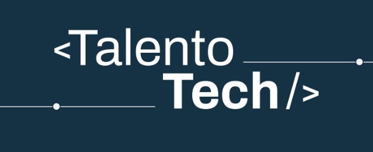

# Iniciación a la Programación con Python - Comisión 24217
Profesor: FERNANDEZ, Jose &nbsp;&nbsp;
&nbsp;&nbsp;

Tutora Pedagógica (Hasta 13/11): ARRIBILLAGA, Amancay &nbsp;&nbsp; 

Tutora Pedagógica (Desde 14/11): THEMTHAM, Natalia &nbsp;&nbsp;

Estudiante: GUTIERREZ, Federico &nbsp;&nbsp;
&nbsp;&nbsp;
&nbsp;&nbsp;
&nbsp;&nbsp;

## Ruta N° 1: Fundamentos de programación en Python | 

- [x] Clase 01 | Introducción
- [x] Clase 02 | Algoritmos
- [x] Clase 03 | Python
- [x] Clase 04 | Definimos Avances 
- [x] Clase 05 | Condicionales
- [x] Clase 06 | Bucles while

## Ruta N° 2: Estructuras de Datos en Python | 

- [x] Clase 07 | Listas y Tuplas
- [x] Clase 08 | Alta y consulta de datos
- [x] Clase 09 | Bucles for
- [x] Clase 10 | Diccionarios
- [x] Clase 11 | Funciones
- [x] Clase 12 | Funciones para el Proyecto Integrador
- [x] Clase 13 | Módulos

## Ruta N° 3: Introducción a Bases de Datos | 

- [ ] Clase 14 | Fundamentos SQL
- [ ] Clase 15 | SQLite
- [ ] Clase 16 | Ruta de Avance

## Desafíos y Ejercicios Complementarios | 

- [x] Clase 04 | Desafío 1: Datos personales en formato de tarjeta
- [x] Clase 06 | Ejercicios complementarios
- [x] Clase 07 | Ejercicios complementarios

## Ruta de avance | 

- [x] Clase 04 | Ruta de Avance 1: Creación del menú de opciones [DEVOLUCIÓN](https://www.canva.com/design/DAGUEvQFTFU/4lZ1nlNeMar8L15lNW64Qw/view?utm_content=DAGUEvQFTFU&utm_campaign=designshare&utm_medium=link&utm_source=editor)
- [x] Clase 08 | Pre - Entrega del Proyecto [DEVOLUCIÓN](https://www.canva.com/design/DAGVWLDvIUw/APG2Si6jTh-n2cTrXtq6ag/view?utm_content=DAGVWLDvIUw&utm_campaign=designshare&utm_medium=link&utm_source=editor)
- [ ] Clase 12 | Ruta de Avance 2: Funciones [DEVOLUCIÓN](https://http.cat/102)
- [ ] Clase 15 | Proyecto final [DEVOLUCIÓN](https://http.cat/102)

______________________________________________________________________________________________________
### `ÚLTIMA ACTUALIZACIÓN 16/11/2024`